# Yourban CineScope

Application web d'exploration de films de box-office (2022–2024).

**Stack :** React · TypeScript · Express · Node.js  · Recharts · React Icons

---

## Prérequis

- Node.js v18+
- npm v9+

---

## Installation

### 1. Cloner le projet
```bash
git clone https://github.com/johannacode/yourban.git
cd cinescope
```

### 2. Lancer le backend
```bash
cd backend
npm install
npm run dev
```
Le serveur démarre sur **http://localhost:3001**

### 3. Lancer le frontend
```bash
cd frontend
npm install
npm run dev
```
L'application démarre sur **http://localhost:5173**

---

## Structure du projet

```plaintext
cinescope/
├── backend/
│   └── src/
│       ├── routes/       # Endpoints REST (/movies)
│       ├── controllers/  # Logique de chaque route
│       ├── services/     # Lecture/écriture du fichier JSON
│       └── middlewares/  # Validation des données entrantes
├── frontend/
│   └── src/
│       ├── components/   # Briques UI réutilisables
│       ├── pages/        # Vues complètes
│       ├── hooks/        # useMovies, usePagination
│       └── services/     # Appels API (movies.service.ts)
├── shared/
│   └── types/
│       └── movie.ts      # Type Movie partagé frontend/backend
└── data/
    └── movies.json       # Source de données (200 films, 2022–2024)
```
---
---
## Fonctionnalités

### Features obligatoires

- **Liste des films**
  - Titre
  - Genre
  - Recettes
  - Date de sortie
  - Note presse

- **Filtre par genre**
  - Menu déroulant dynamique basé sur les données disponibles

- **Tri des films**
  - Par recettes ou par date
  - Ordre croissant / décroissant via boutons toggle

- **Compteurs dynamiques**
  - Nombre de films affichés
  - Recettes cumulées
  - Note moyenne
  - Mise à jour automatique à chaque filtre / tri

- **Page détail film**
  - Toutes les informations complètes du film

---

### Features bonus

- **Statistiques par genre**
  - 3 graphiques côte à côte (Recharts)
    - Recettes totales
    - Note presse moyenne
    - Nombre de films

- **Moteur de recommandation**
  - 3 films similaires affichés sur la page détail
  - Basé sur un algorithme de similarité (voir section dédiée)

- **CRUD complet**
  - API Express
  - Persistance des données dans un fichier JSON
  - Création / lecture / mise à jour / suppression de films
---
## API REST : Endpoints

| Méthode | Route        | Description                         |
|----------|--------------|-------------------------------------|
| GET      | `/movies`    | Récupère tous les films             |
| GET      | `/movies/:id`| Récupère un film par son ID         |
| POST     | `/movies`    | Crée un nouveau film                |
| PUT      | `/movies/:id`| Modifie un film existant            |
| DELETE   | `/movies/:id`| Supprime un film                    |
---
---
## Interface d'administration

Une interface graphique de type **CRUD** est disponible à l'adresse suivante :

http://localhost:5173/admin

ou alors via le bouton Admin en bas de la page principale. 

---

### Fonctionnalités

Cette interface permet de gérer les films directement depuis l’application :

- **Créer un nouveau film**
  - Via un formulaire dédié

- **Modifier un film existant**
  - Accessible via le bouton **"Modifier"** dans la liste

- **Supprimer un film**
  - Avec confirmation avant suppression

---

### Fonctionnement

Toutes les actions (création, modification, suppression) passent par l’API Express et sont persistées dans le fichier :

```txt
movies.json
```

---

### Accès

Cette interface **n’est pas protégée par authentification**.

Elle est volontairement laissée ouverte durant le test afin de :
- démontrer le fonctionnement du CRUD
- servir de preuve technique dans le cadre du test

Le projet étant conçu comme une démonstration front-end légère, aucune base de données ni gestion des utilisateurs n’ont été implémentées pour le moment.
---

## Moteur de recommandation

### Principe

Sur la page détail de chaque film, l'application affiche **3 films similaires** calculés grâce à un algorithme de score de similarité basé sur plusieurs critères.

---

## Calcul du score

Le score final est calculé sur **100 points**.

| Critère | Poids | Méthode |
|----------|--------|----------|
| Genre identique | 50 pts | Égalité stricte entre les genres |
| Proximité des recettes | 30 pts | `30 × (1 - écart / recette_max)` |
| Proximité de la note presse | 20 pts | `20 × (1 - écart_note / 10)` |

### Formule simplifié

```bash
if (film.genre === cible.genre) score += 50

const ecartRecettes = Math.abs(film.recettes - cible.recettes)
score += 30 * (1 - ecartRecettes / recetteMax)

if (film.note !== null && cible.note !== null) {
  score += 20 * (1 - Math.abs(film.note - cible.note) / 10)
}
```

---

## Pourquoi cet algorithme ?

### Genre (50 pts)

Le genre est le critère le plus important, car c’est généralement le premier filtre naturel utilisé par les spectateurs lorsqu’ils recherchent un film similaire.

Exemple : une personne qui apprécie un film de science-fiction cherchera souvent un autre film du même univers ou du même style.

---

### Recettes (30 pts)

Les recettes permettent d’estimer la popularité et l’ampleur de la production.

Deux films ayant des budgets ou des performances commerciales proches ont souvent :
- une mise en scène comparable,
- des ambitions similaires,
- un public cible proche.

---

### Note presse (20 pts)

La note presse agit comme un critère d’ajustement final.

Elle permet de rapprocher des films ayant un niveau de qualité perçu similaire selon les critiques spécialisées.

---

## Aperçu

### Page principale : 

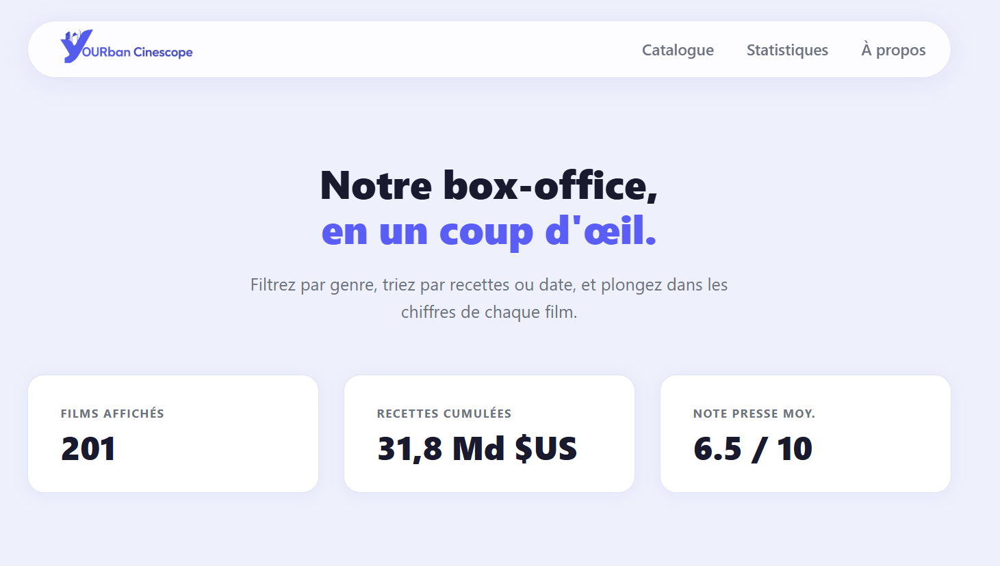
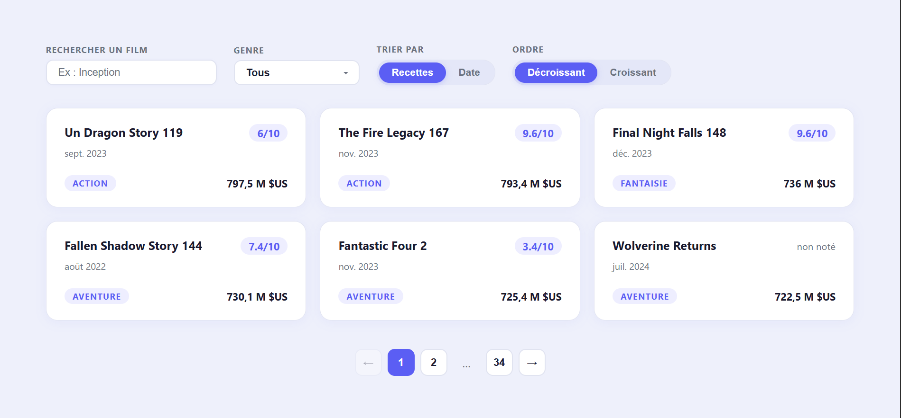
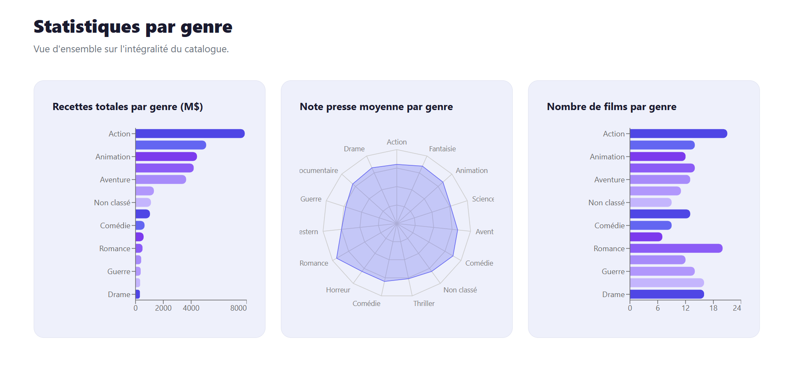
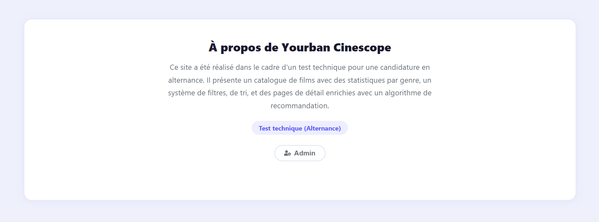

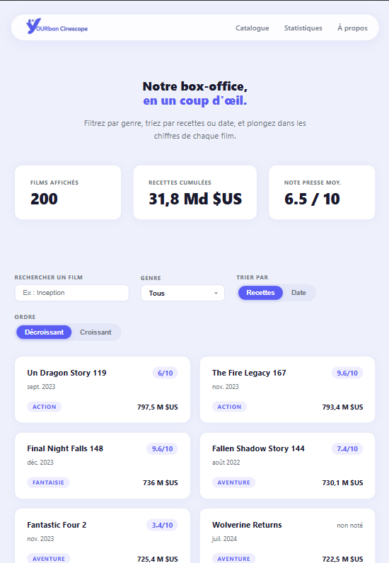
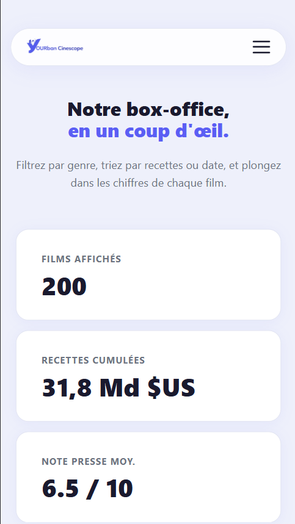

### Page admin : 

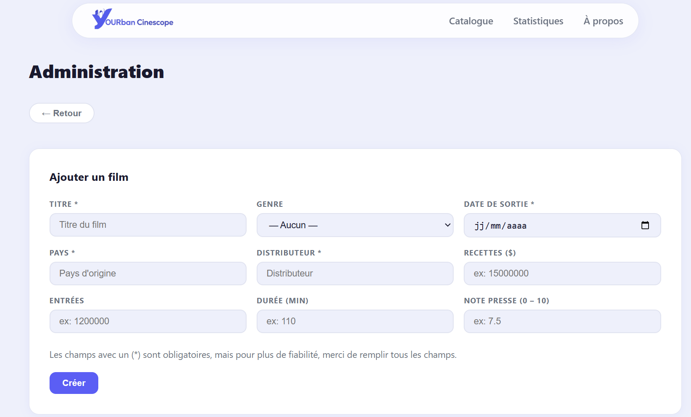
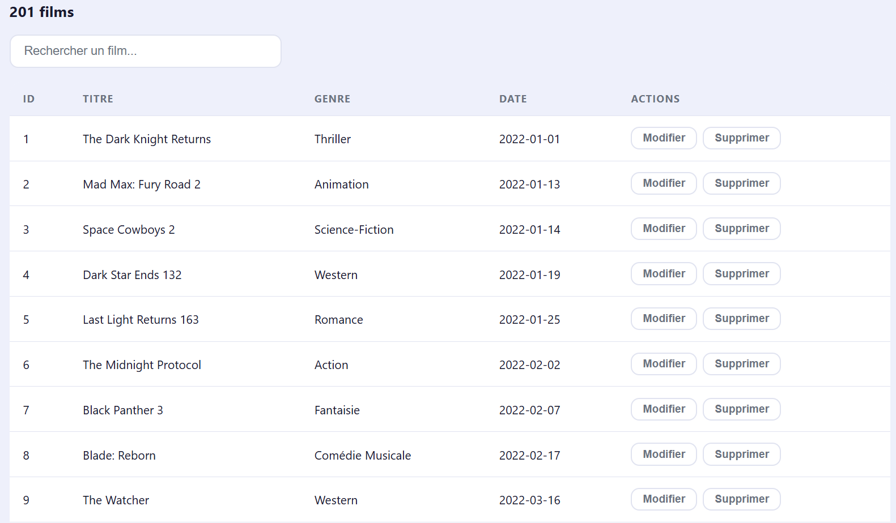
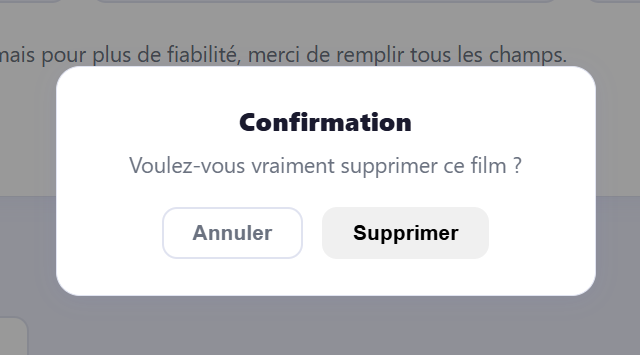
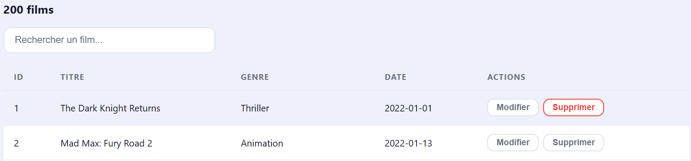


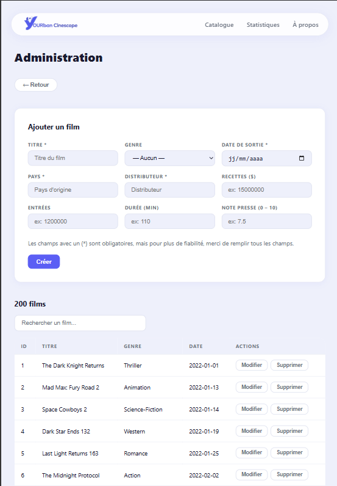
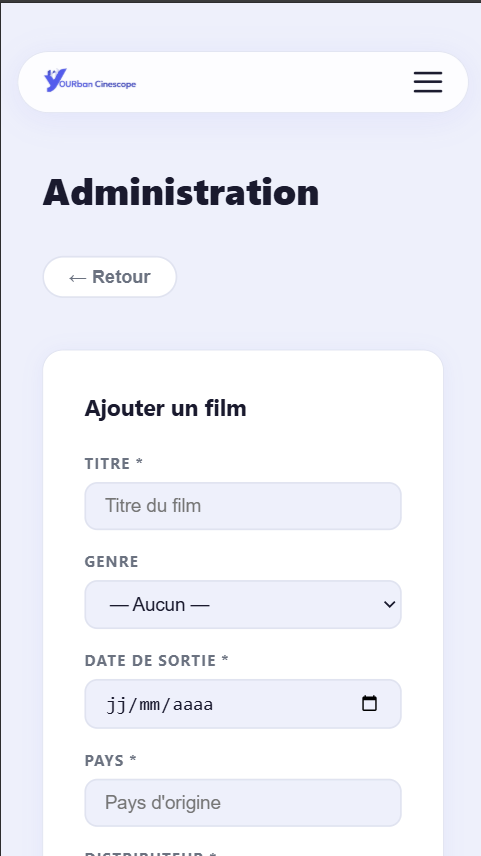

*Projet réalisé par Johanna Angloma dans le cadre d'un test technique pour une candidature en alternance.*